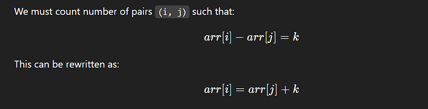

# **Problem: Count Pairs With Given Difference**

# ✅ **1. Brute Force Approach**

### **Idea**

Check all pairs `(i, j)` using two nested loops.

### **Steps**

* Loop `i` from `0 to n-1`
* Loop `j` from `0 to n-1`
* If `arr[i] - arr[j] == k`, increment count

### **Time Complexity**

**O(N²)** → double loop

### **Space Complexity**

**O(1)**

### **Code (Brute)**

<pre class="overflow-visible!" data-start="654" data-end="921">

<code class="whitespace-pre! language-cpp">intcountBrute(vector<int> &arr, int k) {
    int n = arr.size();
    int count = 0;

    for (int i = 0; i < n; i++) {
        for (int j = 0; j < n; j++) {
            if (arr[i] - arr[j] == k)
                count++;
        }
    }
    return count;
}
</code>

</pre>

---

# ⚡ **2. Better Approach – Sorting + Two Pointers**

### **Idea**

Sort the array and use two pointers `i` and `j`.

### **Steps**

1. Sort array
2. Use two pointers:
   * If `arr[j] - arr[i] < k` → move `j++`
   * If `arr[j] - arr[i] > k` → move `i++`
   * If equal → count++, move both

### **Time Complexity**

* Sorting: **O(N log N)**
* Two pointers: **O(N)**

  ✔ Total: **O(N log N)**

### **Space Complexity**

**O(1)** (if sorting in-place)

### **Code (Better)**

<pre class="overflow-visible!" data-start="1395" data-end="1839">

<code class="whitespace-pre! language-cpp">intcountBetter(vector<int> &arr, int k) {
    sort(arr.begin(), arr.end());
    int n = arr.size();
    int i = 0, j = 1, count = 0;

    while (j < n) {
        int diff = arr[j] - arr[i];

        if (diff == k) {
            count++;
            i++;
            j++;
        } 
        elseif (diff < k) {
            j++;
        } 
        else {
            i++;
        }

        if (i == j) j++;
    }
    return count;
}
</code>

</pre>

---

# 🚀 **3. Optimal Approach – Using Hashing (O(N))**

### **Idea**

For every element `x` in array:

* Check if `(x + k)` exists
* Because:

  arr[i]−arr[j]=k  ⟺  arr[i]=arr[j]+karr[i] - arr[j] = k \iff arr[i] = arr[j] + k**a**rr**[**i**]**−**a**rr**[**j**]**=**k**⟺**a**rr**[**i**]**=**a**rr**[**j**]**+**k**

### **Steps**

1. Insert all elements into an unordered set.
2. For each `x`, check if `x + k` exists.
3. Count such matches.

### **Time Complexity**

**O(N)** — hash lookups are O(1)

### **Space Complexity**

**O(N)** — for the hash set

### **Code (Optimal)**

<pre class="overflow-visible!" data-start="2307" data-end="2544">

<code class="whitespace-pre! language-cpp">intcountOptimal(vector<int> &arr, int k) {
    unordered_set<int> st(arr.begin(), arr.end());
    int count = 0;

    for (int x : arr) {
        if (st.count(x + k)) {
            count++;
        }
    }
    return count;
}
</code>

</pre>

---

# 📌 Final Summary Table

| Approach                                | Time Complexity | Space Complexity | Notes                       |
| --------------------------------------- | --------------- | ---------------- | --------------------------- |
| **Brute**                         | O(N²)          | O(1)             | Check all pairs             |
| **Better (Sorting + 2 Pointers)** | O(N log N)      | O(1)             | Efficient but needs sorting |
| **Optimal (Hashing)**             | **O(N)**  | **O(N)**   | Best solution               |

---
